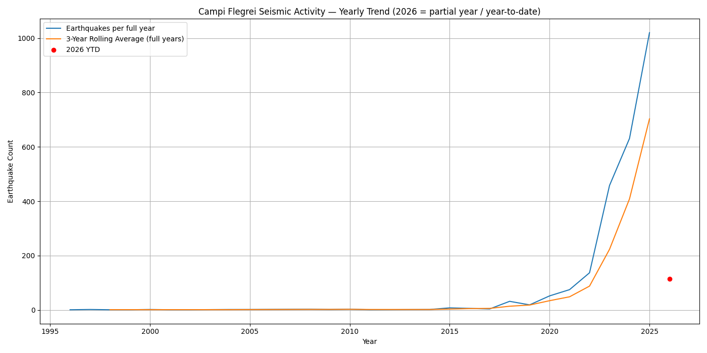
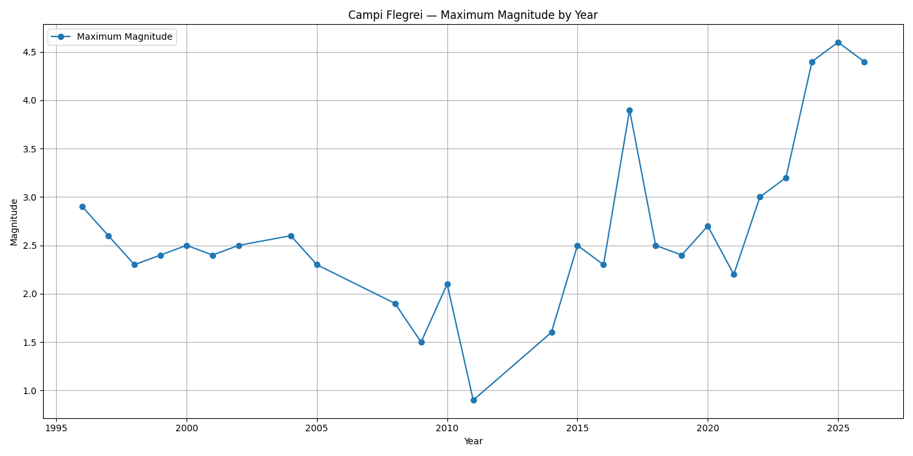
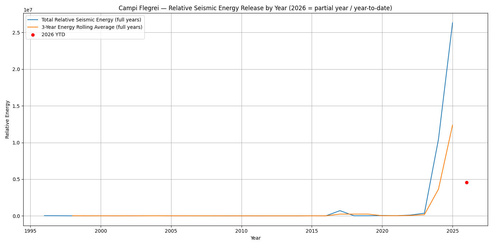

# Campi Flegrei Seismic Intelligence

Open-source seismic monitoring and historical analytics project based on official INGV earthquake data.

The project analyzes approximately 30 years of seismic activity in the Campi Flegrei / Monte di Procida area using Python, Pandas, and Matplotlib.

Main goals:
- monitor earthquake activity
- analyze seismic trends
- visualize magnitude and depth patterns
- generate historical seismic summaries
- create analytical charts and reports

---

## What This Project Demonstrates

This project demonstrates practical data collection, cleaning, analysis, and visualization skills using official seismic data.

Key skills shown:
- working with public scientific data sources
- collecting earthquake events through web services
- processing structured datasets with Pandas
- creating yearly and monthly analytical summaries
- visualizing seismic activity, magnitude, depth, and energy trends
- communicating limitations clearly and responsibly

---

## Technologies Used

- Python
- Pandas
- Requests
- Matplotlib
- CSV Data Pipelines
- Scientific Data Analysis

---

## Workflow

INGV seismic web service
↓
Earthquake event collection
↓
Data cleaning and normalization
↓
Historical aggregation with Pandas
↓
CSV exports
↓
Visualization and reporting

---

## Project Structure

```bash
campi-flegrei-seismic-intelligence/
│
├── collect_earthquakes.py
├── analyze_earthquakes.py
├── requirements.txt
├── README.md
│
├── data/
│   └── earthquakes.csv
│
├── yearly_analysis.csv
├── monthly_analysis_2020_2026.csv
├── depth_analysis_yearly.csv
│
├── charts/
│   ├── earthquake_activity_yearly.png
│   ├── max_magnitude_yearly.png
│   ├── seismic_energy_yearly.png
│   ├── earthquake_activity_monthly_2020_2026.png
│   ├── max_magnitude_monthly_2020_2026.png
│   ├── seismic_energy_monthly_2020_2026.png
│   ├── shallow_earthquakes_yearly.png
│   └── avg_depth_yearly.png
│
└── .env
```

---

## Installation

```bash
pip install -r requirements.txt
```

---

## Run Pipeline

Collect earthquake data:

```bash
python3 collect_earthquakes.py
```

Analyze earthquake data and generate outputs:

```bash
python3 analyze_earthquakes.py
```

---

## Key Features

- Historical seismic event analysis
- Structured earthquake dataset processing
- Magnitude and depth trend analysis
- CSV export pipelines
- Automated analytical summaries
- Seismic activity visualizations

---

## Example Charts

### Earthquake Activity by Year



### Maximum Magnitude Trends



### Seismic Energy Release



---

## Data Source

Official seismic data provided by:

- INGV — Istituto Nazionale di Geofisica e Vulcanologia
- ISIDe seismic catalog
- FDSN Event Web Service

Sources:
- https://terremoti.ingv.it/
- https://iside.rm.ingv.it/
- https://webservices.ingv.it/

All data rights belong to their respective owners.

---

## Important Note

This project does not predict earthquakes and should not be considered a civil protection or forecasting tool.

The project is intended for educational, analytical, and portfolio purposes only.

---

## Future Improvements

- Interactive seismic dashboards
- Automated scheduled monitoring
- Seismic anomaly detection
- Geographic event mapping
- Real-time activity alerts

---

## Author

Yurii Vasylenko
